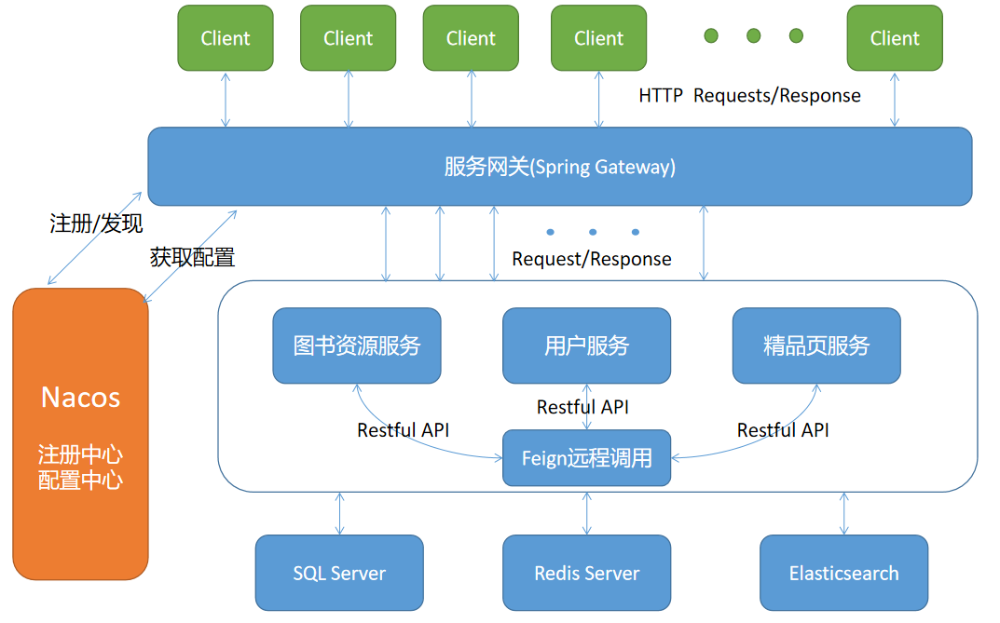

# LightReading

这个项目是跟着开源微服务项目Light-Reading-Cloud做的，主要是为了学习微服务思想和开发流程。

## 项目整体架构：

项目正在完善中...

## 图书资源服务

图书资源数据库主要的表较多，以下介绍几个主要的表：

- book表：书本的描述表，包含书本描述、作者ID、图书ID、图书评分、分类等信息

- book_chapter表：书的章节表，书的ID、章节名、章节所在的位次等信息

- book_author表：作者信息表，包含一些作者的信息

- book_list表：记录一些热门书单的书单表，包含书单名、被书单包含的书的id等信息

试想，读完本章的时候向下滑就可以轻松切换到下一章节；或者一不小心手滑，章节选择的时候选到了想读的下一章，返回目录再找位置就会稍嫌麻烦，因此希望上滑就到上一章。所以为了方便用户的使用，我们把书本的内容按章节组织为一个双向链表的形式，方便找到相邻的章节，同时也可以减小开销。
